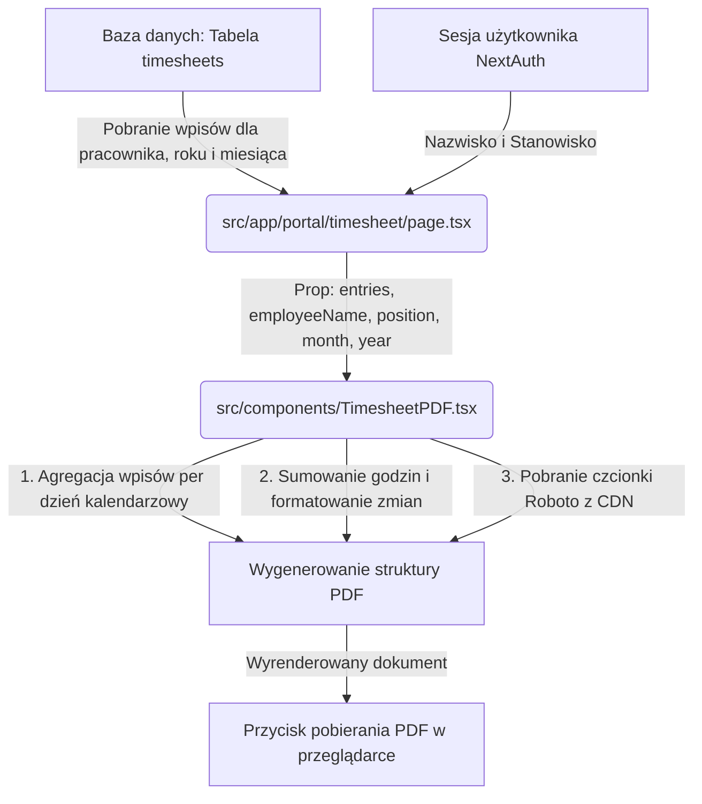

# Dokumentacja Techniczna: Generator Karty Obecności PDF

Niniejszy dokument opisuje architekturę, szczegóły implementacyjne oraz zasady utrzymania modułu generowania kart obecności w formacie PDF w systemie **Drift Park Extreme**.

---

## 1. Cel i Wymagania Biznesowe

Generator PDF umożliwia pracownikom eksportowanie ich miesięcznych kart ewidencji czasu pracy do pliku PDF w celu wydruku lub archiwizacji. Główne wymagania zrealizowane w tym module to:
- **Pełna obsługa polskich znaków diakrytycznych** (`ą, ć, ę, ł, ń, ó, ś, ź, ż` oraz wersje wielkie).
- **Zgodność z szablonem graficznym**: wyśrodkowany tytuł, dane pracownika po lewej stronie, oraz tabela o układzie odpowiadającym drukowanej karcie obecności.
- **Siatka dni kalendarzowych**: tabela musi zawierać wiersz dla każdego dnia danego miesiąca (od 1 do 28/29/30/31), niezależnie od tego, czy pracownik pracował w tym dniu.
- **Dopasowanie do jednej strony A4**: cały dokument musi bezwzględnie mieścić się na pojedynczej stronie A4, aby zapobiec powstawaniu pustych lub częściowo zapełnionych drugich stron.
- **Obsługa wielu zmian**: jeśli pracownik pracował kilka razy w ciągu jednego dnia, godziny rozpoczęcia i zakończenia są łączone, a czas pracy jest sumowany w jednym wierszu.
- Podpis pracownika: każdemu dniu towarzyszy puste pole przeznaczone na odręczny podpis pracownika.
- Sekcja podpisów na dole strony: Na samym dole dokumentu (pod tabelą) znajduje się oficjalna sekcja zatwierdzenia. W sekcji pracownika automatycznie wstawiany jest wydrukowany podpis systemowy w formacie `/[Imię i Nazwisko]/` (np. `/[Michał Dygdoń]/`), natomiast sekcja managera zawiera linię kropkową przeznaczoną na podpis odręczny.
- Podsumowanie: wiersz podsumowania `Razem:` na dole tabeli zawiera sumę przepracowanych godzin z całego miesiąca.

---

## 2. Architektura i Przepływ Danych

Moduł składa się z dwóch kluczowych plików:

1. **`src/components/TimesheetPDF.tsx`**:
   - Komponent zawierający strukturę dokumentu PDF zdefiniowaną przy użyciu biblioteki `@react-pdf/renderer`.
   - Odpowiada za rejestrację czcionek, transformację i agregację danych wejściowych, obliczenia matematyczne oraz ostylowanie i renderowanie PDF.
2. **`src/app/(portal)/timesheet/page.tsx`**:
   - Strona portalu pracownika, która ładuje wpisy czasu pracy dla wybranego miesiąca i roku.
   - Używa dynamicznego importu `PDFDownloadLink` z `@react-pdf/renderer` do renderowania przycisku pobierania po stronie klienta.
   - Przekazuje do komponentu PDF dane zalogowanego użytkownika (`employeeName`, `position`), nazwę miesiąca, rok oraz 1-bazowy numer miesiąca (`month`).

### Diagram przepływu danych


---

## 3. Szczegóły Implementacji Technicznej

### 3.1. Obsługa Polskich Znaków (Rejestracja Czcionki)
Domyślne czcionki wbudowane w bibliotekę `react-pdf` (np. `Helvetica`, `Times-Roman`) obsługują wyłącznie kodowanie `WinAnsiEncoding`, w którym brakuje polskich znaków diakrytycznych. Próba ich użycia skutkuje brakiem znaków lub błędami renderowania.

Problem ten został rozwiązany poprzez zarejestrowanie czcionki **Roboto** (wspierającej kodowanie Latin Extended) pobieranej bezpośrednio z lokalnych plików projektu (`/fonts/Roboto-Regular.ttf` oraz `/fonts/Roboto-Bold.ttf`). 

Ścieżki te są serwowane z tej samej domeny co portal, co całkowicie eliminuje problemy z CORS, politykami bezpieczeństwa przeglądarek (CSP) czy brakiem dostępu do internetu:
- **Regular**: `/fonts/Roboto-Regular.ttf`
- **Bold**: `/fonts/Roboto-Bold.ttf`

Rejestracja czcionki w kodzie:

```typescript
import { Font } from '@react-pdf/renderer';

Font.register({
  family: 'Roboto',
  fonts: [
    { src: '/fonts/Roboto-Regular.ttf' }, // Regular
    { src: '/fonts/Roboto-Bold.ttf', fontWeight: 'bold' } // Bold
  ]
});
```

Wszystkie style tekstowe w komponencie (takie jak `title`, `metaRow`, `metaLabel`, `metaValue`, `cellText` oraz `cellTextBold`) mają **jawnie ustawioną** właściwość `fontFamily: 'Roboto'`. Jest to kluczowe, ponieważ w bibliotece `@react-pdf/renderer` dziedziczenie stylów (w tym rodziny czcionek) z komponentu nadrzędnego `Page` nie propaguje się automatycznie do elementów potomnych, które posiadają własne style. Jawna deklaracja gwarantuje poprawne wyświetlanie znaków diakrytycznych w każdym polu tekstowym.

### 3.2. Agregacja Danych Kalendarzowych i Podpis Elektroniczny
Baza danych przechowuje wpisy ewidencji czasu pracy jako pojedyncze rekordy z datą w formacie `YYYY-MM-DD`. Aby stworzyć pełną kartę obecności na cały miesiąc:
1. Obliczamy liczbę dni w danym miesiącu przy użyciu standardowego mechanizmu JavaScript:
   ```typescript
   const daysInMonth = new Date(year, monthNumber, 0).getDate();
   ```
   *(Uwaga: przekazanie `monthNumber` (1-12) jako indeksu miesiąca oraz `0` jako dnia zwraca ostatni dzień poprzedniego miesiąca, co dla 1-bazowego numeru miesiąca daje dokładnie liczbę dni tego miesiąca).*
2. Grupujemy wpisy pracownika według dnia miesiąca:
   ```typescript
   const entriesByDay: Record<number, TimesheetEntry[]> = {};
   entries.forEach(entry => {
     if (!entry.date) return;
     const day = parseInt(entry.date.split('-')[2], 10);
     if (!isNaN(day)) {
       if (!entriesByDay[day]) entriesByDay[day] = [];
       entriesByDay[day].push(entry);
     }
   });
   ```
3. Iterujemy od `1` do `daysInMonth`. Jeśli dla danego dnia istnieją wpisy:
   - Sortujemy je chronologicznie według godziny rozpoczęcia.
   - Jeśli wpis jest jeden, pobieramy bezpośrednio jego `startTime` i `endTime`.
   - Jeśli wpisów jest więcej (np. dwie zmiany jednego dnia), łączymy je przecinkiem: `sortedDayEntries.map(e => e.startTime).join(', ')`.
   - Sumujemy czas trwania wszystkich zmian w tym dniu i formatujemy jako liczbę dziesiętną z dwoma miejscami po przecinku (np. `8.50`).
   - **Automatyczny podpis**: Jeśli w danym dniu pracownik przepracował chociaż jedną zmianę, kolumna "Podpis pracownika" jest automatycznie uzupełniana wartością `/Imię i Nazwisko/` (np. `/Michał Dygdoń/`), co reprezentuje elektroniczne potwierdzenie obecności z systemu. Dla dni nieprzepracowanych pole pozostaje całkowicie puste.

### 3.3. Estetyka Tabeli (Siatka 1px Bez Podwójnych Krawędzi)
Ze względu na to, że `react-pdf` nie obsługuje właściwości CSS `border-collapse: collapse`, nadanie obramowania `border: 1px solid #000` na każdej komórce skutkowałoby podwójną grubością linii stykających się komórek (2px).

Aby uzyskać jednolitą, estetyczną siatkę o grubości dokładnie 1px, zastosowaliśmy następujący schemat obramowania:
- Kontener tabeli (`table`) posiada wyłącznie **górną** i **lewą** krawędź.
- Każda komórka tabeli (`cell`) posiada wyłącznie **dolną** i **prawą** krawędź.

Dzięki temu krawędzie komórek idealnie uzupełniają obramowanie kontenera, tworząc spójną siatkę bez żadnych podwójnych linii:

```typescript
const styles = StyleSheet.create({
  table: {
    flexDirection: 'column',
    borderTopWidth: 1,
    borderLeftWidth: 1,
    borderColor: '#000000',
  },
  cell: {
    borderBottomWidth: 1,
    borderRightWidth: 1,
    borderColor: '#000000',
    height: '100%',
  }
});
```

### 3.4. Budżet Wysokości Strony (Gwarancja Jednej Strony A4)
Format A4 w pionie ma wysokość dokładnie **842 punktów (points)**. Aby zagwarantować, że karta obecności dla każdego miesiąca (również 31-dniowego) zmieści się na jednej stronie, wysokość poszczególnych elementów została precyzyjnie skalkulowana:

| Element dokumentu | Wysokość jednostkowa (pt) | Mnożnik / Ilość | Suma wysokości (pt) |
| :--- | :---: | :---: | :---: |
| Margines górny i dolny strony | 30 | 2 | 60 |
| Tytuł główny + margines dolny | 16 + 25 | 1 | 41 |
| Metadane pracownika + margines | 12 + 6 | 2 | 36 |
| Odstęp przed tabelą | 20 | 1 | 20 |
| Nagłówek tabeli (`tableHeaderRow`) | 28 | 1 | 28 |
| Wiersze dni (`tableRow`) | 18 | Max 31 | 558 |
| Wiersz podsumowania (`tableRow`) | 18 | 1 | 18 |
| **CAŁKOWITA WYSOKOŚĆ** | - | - | **761 pt** |

Pozostały zapas bezpieczeństwa wynosi **81 pt** (842 - 761). Gwarantuje to, że dokument nigdy nie przejdzie na drugą stronę, niezależnie od liczby dni w miesiącu oraz ewentualnych niewielkich wahań w renderowaniu tekstu przez silniki PDF różnych przeglądarek.

---

## 4. Konfiguracja Kolumn i Szerokości

Szerokości kolumn zostały dobrane proporcjonalnie do ich zawartości, ze szczególnym uwzględnieniem dodatkowego miejsca na odręczny podpis pracownika:

| Nazwa kolumny | Identyfikator stylu | Szerokość (%) | Wyrównanie tekstu | Opis zawartości |
| :--- | :--- | :---: | :---: | :--- |
| **Dzień miesiąca** | `colDay` | 12% | Środek | Pogrubiony numer dnia z kropką (np. `1.`) |
| **Rozpoczęcie pracy** | `colStart` | 18% | Środek | Godzina startu (np. `10:00`) lub połączone godziny |
| **Zakończenie pracy** | `colEnd` | 18% | Środek | Godzina zakończenia (np. `18:00`) lub połączone godziny |
| **Ilość godzin** | `colHours` | 15% | Środek | Suma godzin (np. `8.00`), pogrubiona w podsumowaniu |
| **Podpis pracownika** | `colSig` | 37% | Środek | Puste pole przeznaczone na podpis fizyczny |

---

## 5. Utrzymanie i Prace Konserwacyjne

### 5.1. Zmiana wysokości wierszy lub czcionki
Gdyby w przyszłości zaszła potrzeba zwiększenia wysokości wiersza tabeli (np. do `20pt`), należy pamiętać o przeliczeniu budżetu wysokości strony. Zwiększenie wysokości wierszy o 2pt na 31 dniach zwiększy wysokość tabeli o `62pt`. Przy obecnym zapasie bezpieczeństwa (81pt) zmiana ta jest dopuszczalna, jednak zaleca się utrzymywanie wysokości wiersza w przedziale `16pt` - `19pt`.

### 5.2. Zmiana kolorystyki nagłówka
Tło nagłówka tabeli jest zdefiniowane w stylu `tableHeaderRow`:
```typescript
tableHeaderRow: {
  flexDirection: 'row',
  backgroundColor: '#e0e0e0', // Zmiana tego koloru (np. na ciemniejszy szary lub firmowy)
  height: 28,
  alignItems: 'center',
}
```

### 5.3. Aktualizacja linków do czcionki Roboto
W przypadku niedostępności obecnego CDN Google Fonts, można zmienić adresy URL w metodzie `Font.register`. Nowe adresy muszą wskazywać **bezpośrednio na pliki binarnie z rozszerzeniem `.ttf`** (react-pdf nie obsługuje arkuszy stylów CSS importujących czcionki).
